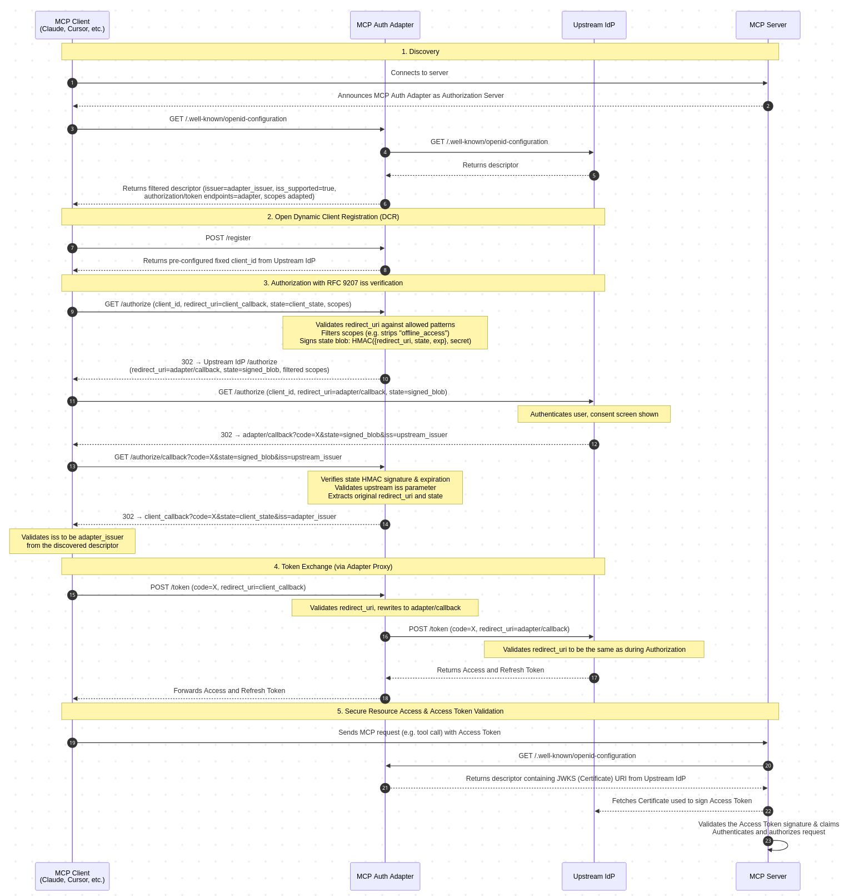
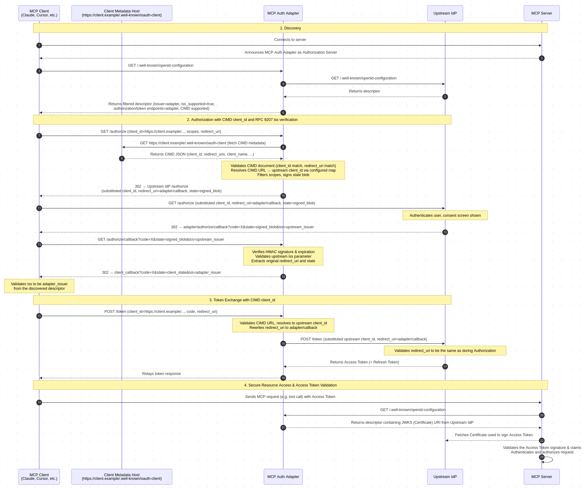
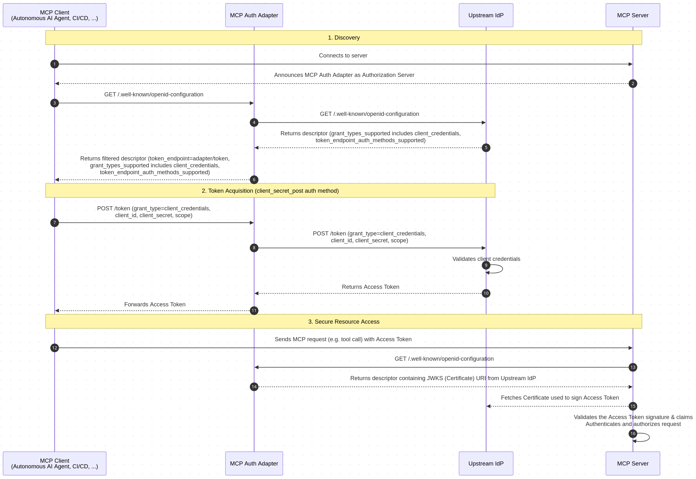

# MCP Auth Adapter

<p align="center">
  
</p>

[](https://github.com/velias/mcp-auth-adapter/actions/workflows/ci.yml)
[](https://github.com/velias/mcp-auth-adapter/actions/workflows/ci.yml)
[](https://securityscorecards.dev/viewer/?uri=github.com/velias/mcp-auth-adapter)

An OAuth/OIDC authentication adapter for [Model Context Protocol (MCP)](https://modelcontextprotocol.io/) clients. It sits in front of any OAuth 2.0 / OIDC upstream IdP - such as Keycloak, Auth0, Okta, Azure AD, Google Identity, or any provider serving standard OAuth 2.0 / OIDC discovery metadata - and provides functionality required by the [MCP Authorization specification](https://modelcontextprotocol.io/specification/2025-11-25/basic/authorization) for the most common MCP clients (Claude Code/Desktop, Cursor IDE, ChatGPT, Gemini CLI, VS Code, ...) and [their known problematic behaviours](#known-mcp-client-behaviors).

MCP servers [announce this adapter as their authorization server](https://modelcontextprotocol.io/specification/2025-11-25/basic/authorization#authorization-server-discovery). MCP clients discover it via `.well-known` and interact with its endpoints. **Authentication itself and token issuing are performed by the upstream IdP** - this adapter is only a very thin, transparent, stateless facade.

### MCP Spec Compatibility

- **MCP Authorization Specification 2025-11-25** — v1.0 fully compatible
- **MCP Authorization Specification 2026-07-28 RC** — v2.0 fully compatible (adds mandatory RFC 9207 `iss` parameter validation)
- **[MCP OAuth Client Credentials extension](https://modelcontextprotocol.io/extensions/auth/oauth-client-credentials)** — supported in v2.1 (passthrough to upstream IdP)
- **[MCP Enterprise-Managed Authorization extension](https://modelcontextprotocol.io/extensions/auth/enterprise-managed-authorization)** — supported in v2.1 (passthrough to upstream IdP)

### Features

- **Well-known discovery** - filtered, MCP-focused view of the upstream IdP metadata with injected adapter endpoints and tailored configurations. See [Upstream Well-Known Handling](#upstream-well-known-handling).
- **Open Dynamic Client Registration (DCR)** (optional) - returns a pre-configured fixed `client_id` for all registering MCP clients per [RFC 7591](https://rfc-editor.org/rfc/rfc7591). See [Open DCR and its Security Limitations](#open-dcr-and-its-security-limitations).
- **Scope filtering** (optional) - intercepts authorization requests to modify scopes before redirecting to the upstream IdP.
- **RFC 9207 `iss` parameter validation** - mandatory authorization response issuer verification preventing OAuth mix-up attacks per the MCP Auth Spec. See [RFC 9207 iss parameter validation](#rfc-9207-iss-parameter-validation).
- **Resource parameter validation** (optional) - validates the [RFC 8707](https://www.rfc-editor.org/rfc/rfc8707) `resource` parameter required by the MCP specification, with configurable enforcement, format checking, and allowlist filtering. See [Resource Parameter Validation (RFC 8707)](#resource-parameter-validation-rfc-8707).
- **Client Credentials passthrough** - transparently proxies `client_credentials` and JWT bearer grants to the upstream IdP per the [MCP OAuth Client Credentials extension](https://modelcontextprotocol.io/extensions/auth/oauth-client-credentials). See [Client Credentials Passthrough](#client-credentials-passthrough).
- **CIMD adapter** (EXPERIMENTAL, optional) - accepts [Client ID Metadata Document](https://datatracker.ietf.org/doc/draft-ietf-oauth-client-id-metadata-document/) style `client_id` URLs, validates metadata documents, and maps them to upstream IdP client_ids. See [CIMD Adapter](#cimd-adapter-experimental).

See [Flow Diagrams](#flow-diagrams) to understand functionality better.

## Container Image

Pre-built container images are published to GitHub Container Registry on every release. This is the recommended way to deploy in production - no Node.js installation required.

**Prerequisites:** [Docker](https://docs.docker.com/get-docker/) or [Podman](https://podman.io/docs/installation)

### Pull and run

Podman is used in examples, but you can use `docker` command instead:

```bash
podman run -d --name mcp-auth-adapter \
  -p 3000:3000 \
  -e MCP_BASE_URL=https://mcp-auth.example.com \
  -e MCP_UPSTREAM_SSO_URL=https://sso.example.com/auth/realms/external \
  -e MCP_PROXY_DCR_CLIENT_ID=mcp-client \
  ghcr.io/velias/mcp-auth-adapter:latest
```

Or use an env file for all configuration (see [Configuration](#configuration) below):

```bash
podman run -d -p 3000:3000 --env-file .env ghcr.io/velias/mcp-auth-adapter:latest
```

### Available tags

Each release `vX.Y.Z` produces the following image tags:
- `X.Y.Z` - exact version (recommended for production)
- `X.Y` - latest patch within a minor version
- `X` - latest minor within a major version
- `latest` - most recent release

To build the image locally from source, see [CONTRIBUTING.md](CONTRIBUTING.md#running-with-docker--podman).

## npm Package

The adapter is published on [npm](https://www.npmjs.com/package/mcp-auth-adapter) and can be run directly with `npx` — no cloning or building required.

**Prerequisites:** Node.js >= 20.x, npx or npm

```bash
npx mcp-auth-adapter
```

Or install globally with `npm install -g mcp-auth-adapter` and run as `mcp-auth-adapter`.

Or install it into your Node.js project with `npm install mcp-auth-adapter` to use it.

## Build from Source

**Prerequisites:** Node.js >= 20.x (uses native `fetch`), npm

```bash
npm install
npm run build

# Create .env from the template and edit it
cp .env.example .env

npm start
```

## Configuration

Environment variables are used. All variables are prefixed with `MCP_`. A `.env` file in the project root is loaded automatically, explicit environment variables take precedence.

| Variable | Required | Default | Description |
|---|---|---|---|
| | | | **Core** |
| `MCP_BASE_URL` | Yes | -- | Public base URL of this adapter. Used as `issuer` (RFC 8414 §3.3) and to construct endpoint URLs. Must be `http` or `https`; trailing slashes are stripped automatically. Must exactly match what MCP servers advertise in their Protected Resource Metadata `authorization_servers` array. |
| `MCP_UPSTREAM_SSO_URL` | Yes | -- | Base URL (issuer) of the upstream IdP. Must be `http` or `https`; trailing slashes are stripped automatically. Works with any OAuth 2.0 / OIDC provider. Discovery is attempted via `/.well-known/openid-configuration`, then `/.well-known/oauth-authorization-server` (RFC 8414); on failure, fallback endpoints are derived using Keycloak URL conventions ([see below](#upstream-well-known-handling)). |
| `MCP_PORT` | No | `3000` | Port this app listens on. |
| `MCP_SHUTDOWN_TIMEOUT_SECONDS` | No | `30` | Maximum seconds to wait for in-flight requests to drain after `SIGTERM`/`SIGINT` before force-exiting. |
| | | | **Dynamic Client Registration** |
| `MCP_PROXY_DCR_CLIENT_ID` | No | -- | Fixed `client_id` returned by `POST /register`. Setting this enables the DCR proxy. Must be pre-registered at the upstream IdP as a public client. If omitted, the upstream IdP's registration endpoint is announced directly. |
| | | | **RFC 9207 iss interception** (auto-enables `/authorize` + `/token` proxy) |
| `MCP_PROXY_AUTH_STATE_SECRET` | Conditional | -- | Hex-encoded HMAC secret for signing state blobs (min 32 bytes = 64 hex chars). **Required when the `/authorize` proxy is active** (scope filtering, CIMD, or standalone). Generate with `openssl rand -hex 32`. Must be identical across all pods. |
| `MCP_PROXY_AUTH_STATE_SECRET_PREVIOUS` | No | -- | Previous HMAC secret for zero-downtime key rotation (same format). Set to the old key during rotation; remove after TTL has elapsed. |
| `MCP_PROXY_AUTH_STATE_TTL_MINUTES` | No | `30` | How long (minutes) the signed state blob remains valid. Must cover full user interaction at the upstream IdP (login + registration + MFA + consent). |
| `MCP_PROXY_AUTH_ALLOWED_REDIRECT_URIS` | Conditional | -- | Comma-separated allowed redirect URI patterns. Trailing `*` = prefix match, no `*` = exact match. **Required when `/authorize` proxy is active** (unless CIMD-only). See [known MCP client patterns](#known-mcp-client-redirect-uri-patterns) for common values. |
| | | | **Scope filtering** (auto-enables `/authorize` proxy) |
| `MCP_PROXY_AUTH_SCOPES_REMOVED` | No | -- | Comma-separated scopes to strip from `/authorize` requests (e.g. `offline_access`). Ignored if `MCP_PROXY_AUTH_SCOPES_PRESERVED` is also set. |
| `MCP_PROXY_AUTH_SCOPES_PRESERVED` | No | -- | Comma-separated scopes to keep in `/authorize` requests; all others are stripped. Takes precedence over `MCP_PROXY_AUTH_SCOPES_REMOVED`. |
| | | | **Well-known discovery** |
| `MCP_WELL_KNOWN_SCOPES_SUPPORTED` | No | -- | Comma-separated scopes to announce in `scopes_supported`. If empty, the field is omitted. Note: some MCP clients request all announced scopes -- this controls *announced* scopes, not *forwarded* scopes. |
| `MCP_WELL_KNOWN_REFRESH_MINUTES` | No | `60` | How often (in minutes) to re-fetch the upstream well-known document. |
| | | | **CIMD adapter** (EXPERIMENTAL, auto-enables `/authorize` proxy + `/token` proxy) |
| `MCP_PROXY_CIMD_MAP` | No | -- | JSON object mapping CIMD URLs to upstream IdP client_ids. Format: `{"<cimd_url>":"<upstream_client_id>", ...}`. N:1 mapping supported. CIMD auto-enables when this is non-empty or `MCP_PROXY_CIMD_DEFAULT_CLIENT_ID` is set. |
| `MCP_PROXY_CIMD_DEFAULT_CLIENT_ID` | No | -- | Fallback upstream client_id for CIMD URLs not in the map. If unset, unknown CIMD URLs are rejected with 403 (strict allowlist). |
| `MCP_PROXY_CIMD_CACHE_MINUTES` | No | `30` | Cache TTL (in minutes) for validated CIMD metadata documents. |
| | | | **Resource Parameter Validation (RFC 8707)** |
| `MCP_PROXY_AUTH_REQUIRE_RESOURCE` | No | `false` | Reject `/authorize` and `/token` requests missing the RFC 8707 `resource` parameter. Enable for strict MCP spec compliance; leave disabled if MCP clients don't yet include it. |
| `MCP_PROXY_AUTH_ALLOWED_RESOURCES` | No | -- | Comma-separated allowed resource URI patterns. Trailing `*` = prefix match, `*.domain.com` = domain wildcard (matches domain and all subdomains), no `*` = exact match. When set, `resource` must match a pattern; unmatched values are rejected with 400. |
| | | | **Observability** |
| `MCP_ACCESS_LOG` | No | `true` | Emit per-request access logs at `info` level with client identification (User-Agent, method, path, IP, plus route-specific fields). Set to `false` to disable. |
| `MCP_METRICS_ENABLED` | No | `true` | Enable Prometheus metrics endpoint (`GET /metrics`) and request instrumentation. Set to `false` to disable (zero overhead). |
| `MCP_DEBUG` | No | `false` | Emit structured debug logs for every request. |

## Open DCR and its Security Limitations

MCP Clients need a way to get `client_id` necessary to login through the upstream IdP. 
You can use Open DCR functionality of this adapter if your IdP does not provide it, or if you do not want to use it.

The Open DCR endpoint returns a fixed public `client_id` (`token_endpoint_auth_method: none`) to be used by MCP Clients. 
But as many MCP Clients are local apps, any local application can obtain this `client_id` and start an OAuth flow. 
IdP do not know who is asking for the `client_id`. Two emerging standards address this:

- **DCR with Software Statement Assertion (SSA)** - cryptographically proves client identity via signed JWTs ([RFC 7591 §2.3](https://rfc-editor.org/rfc/rfc7591#section-2.3)). No major MCP client currently includes Software Statements in DCR requests.
- **Client ID Metadata Documents (CIMD)** - the `client_id` is an HTTPS URL pointing to a metadata document. Default mechanism in the [MCP Auth Spec (2025-11-25)](https://modelcontextprotocol.io/specification/2025-11-25/basic/authorization#client-id-metadata-documents), not yet universally adopted. **This adapter includes experimental CIMD support** - see [CIMD Adapter](#cimd-adapter-experimental).

Until "DCR with SSA" or CIMD is widely supported, user consent during login at the upstream IdP is the last line of defense. This is an [accepted limitation of the MCP auth ecosystem](https://modelcontextprotocol.io/specification/2025-11-25/basic/authorization#localhost-redirect-uri-risks).

## RFC 9207 iss parameter validation

The MCP Auth Spec (2026-07-28 RC) mandates `iss` parameter validation in authorization responses per [RFC 9207](https://www.rfc-editor.org/rfc/rfc9207). Without authorization callback interception, MCP clients would reject the upstream IdP's `iss` value because it doesn't match the adapter's well-known `issuer`.

This adapter solves the problem in v2.0 by intercepting the authorization response:

1. **`GET /authorize`** — validates the client's `redirect_uri` against configured patterns, wraps the original `redirect_uri` and `state` into an HMAC-signed state blob, replaces `redirect_uri` with the adapter's callback URL, and redirects to the upstream IdP with own state.
2. **`GET /authorize/callback`** — receives the upstream IdP's redirect, verifies the state blob (HMAC + expiry), validates the upstream `iss` parameter, then redirects to the original MCP client `redirect_uri` with the adapter's `iss` value.
3. **`POST /token`** — proxies token requests, validating and rewriting `redirect_uri` to maintain consistency with what the upstream IdP expects by the OAuth specification.

**Minimal configuration:**

```bash
MCP_BASE_URL=https://mcp-auth.example.com
MCP_UPSTREAM_SSO_URL=https://sso.example.com/auth/realms/external
MCP_PROXY_AUTH_STATE_SECRET=$(openssl rand -hex 32)
MCP_PROXY_AUTH_ALLOWED_REDIRECT_URIS=http://localhost:*,http://127.0.0.1:*
```

**Key rotation** — to rotate the HMAC secret without downtime:

1. Set `MCP_PROXY_AUTH_STATE_SECRET_PREVIOUS` to the current key
2. Set `MCP_PROXY_AUTH_STATE_SECRET` to the new key
3. Wait at least `MCP_PROXY_AUTH_STATE_TTL_MINUTES` (default 30 min)
4. Remove `MCP_PROXY_AUTH_STATE_SECRET_PREVIOUS`

**Security properties:**

- Signed state prevents forging the original `redirect_uri`; `MCP_PROXY_AUTH_ALLOWED_REDIRECT_URIS` validates destinations before the flow begins
- Client's original `state` is preserved inside the blob — tampering is detected via HMAC (`crypto.timingSafeEqual`)
- Configurable TTL prevents reuse of stale authorization responses
- Two-tier upstream `iss` validation — strict when upstream advertises RFC 9207 support, defensive (validate if present) when it doesn't
- Callback only forwards a whitelist of OAuth-defined parameters — arbitrary upstream parameters cannot reach the client
- `redirect_uri` values with fragments, userinfo, or control characters are rejected
- Callback sets `Cache-Control: no-store` and `Referrer-Policy: no-referrer`
- Authorization code is never logged (only `code_present: true/false`)
- State blob is signed, not encrypted — contains redirect_uri and original state (both non-secret); confidentiality relies on TLS and short TTL

## Resource Parameter Validation (RFC 8707)

[RFC 8707](https://www.rfc-editor.org/rfc/rfc8707) defines the `resource` parameter for OAuth 2.0, binding tokens to a specific resource server audience. The MCP specification (2025-06-18+) mandates that clients include `resource` in both `/authorize` and `/token` requests to prevent confused deputy attacks.

### Validation layers

1. **Debug logging** (always active) — `resource` value (or `MISSING`) appears in per-request debug logs. Enable with `MCP_DEBUG=true`; grep for `resource=MISSING` to find non-compliant clients.

2. **Format validation** (always active when parameter present) — `resource` must be a valid absolute URI with `http` or `https` scheme and no fragment per RFC 8707 §2. Malformed values are rejected with `400 invalid_request`.

3. **Optional strict enforcement**:
   - `MCP_PROXY_AUTH_REQUIRE_RESOURCE=true` — rejects requests missing `resource`
   - `MCP_PROXY_AUTH_ALLOWED_RESOURCES` — comma-separated URI patterns (trailing `*` = prefix match) restricting which MCP servers can authenticate through the adapter

**Configuration examples:**

```bash
# Permissive (default) — format validation only, log missing values
MCP_DEBUG=true

# Strict — require resource parameter and restrict to known MCP servers
MCP_PROXY_AUTH_REQUIRE_RESOURCE=true
MCP_PROXY_AUTH_ALLOWED_RESOURCES=https://mcp-tools.example.com/*,https://mcp-data.example.com/mcp

# Domain wildcard — match a domain and all its subdomains
MCP_PROXY_AUTH_ALLOWED_RESOURCES=https://*.corp.example.com/*,https://mcp-data.example.com/mcp
```

### Notes

- **Client support**: MCP client support for `resource` varies (Claude Code/Desktop, VS Code, Cursor IDE, SDKs are at different stages of adoption). **Recommendation**: start with `MCP_PROXY_AUTH_REQUIRE_RESOURCE=false` and monitor logs before enabling enforcement.

- **Upstream IdP compatibility**: The adapter validates `resource` locally and passes it through to upstream IdP. Whether the IdP actually binds the token audience depends on its RFC 8707 support: Keycloak has experimental support since v26.6.0 (requires per-client configuration); Auth0, Okta, and Microsoft Entra ID silently ignore it as of mid-2026. Token audience validation remains the MCP server's responsibility and must be implemented accordingly.

- **`refresh_token` exemption**: The adapter skips `resource` validation for `refresh_token` grants per RFC 8707 §2.2 — the original token's audience binding still applies.

## Client Credentials Passthrough

The adapter transparently proxies OAuth 2.0 client credentials requests to the upstream IdP, supporting the [MCP OAuth Client Credentials extension](https://modelcontextprotocol.io/extensions/auth/oauth-client-credentials). This enables machine-to-machine authentication for MCP without interactive user authorization.

### Supported credential formats

- **Client Secrets** (`grant_type=client_credentials`) — supports both `client_secret_post` (credentials in the request body) and `client_secret_basic` (credentials in the `Authorization: Basic` header per RFC 6749 §2.3.1).
- **JWT Bearer Assertions** (`grant_type=urn:ietf:params:oauth:grant-type:jwt-bearer`) — forwards the `assertion` parameter and any `client_assertion`/`client_assertion_type` parameters to the upstream IdP.

### How it works

The token proxy forwards all request parameters to the upstream IdP without modification. No `redirect_uri` validation or rewriting is applied (those only affect `authorization_code` grants). The `Authorization` header is forwarded for non-CIMD requests.

### Discovery

The adapter includes `client_credentials` in `grant_types_supported` in its well-known metadata (both in the fallback document and as a default when the upstream omits the field). The `token_endpoint_auth_methods_supported` field passes through from the upstream IdP — if the upstream advertises `client_secret_post`, `client_secret_basic`, or `private_key_jwt`, clients will discover them. The fallback document (used when the upstream cannot be reached) includes `client_secret_basic`, `client_secret_post`, and `none`.

### JWT Bearer Assertion `aud` Caveat

When using JWT bearer assertions (RFC 7523), the client constructs a signed JWT with an `aud` (audience) claim set to the authorization server's token endpoint URL. Since MCP clients discover this adapter as the authorization server, they set `aud` to `{MCP_BASE_URL}/token`.

When the adapter proxies this assertion to the upstream IdP, the upstream validates `aud` against **its own** token endpoint URL. This mismatch causes the upstream to reject the assertion.

**Workaround 1 (recommended)**: Configure the upstream IdP to accept the adapter's token endpoint URL (`{MCP_BASE_URL}/token`) as a valid audience for JWT client assertions. In Keycloak, this can be configured per-client under "Credentials > Client Authenticator > Signed JWT > Valid Audiences". Other IdPs have similar settings. This is transparent to clients — no client-side changes required.

**Workaround 2**: Configure the client to use the upstream IdP's token endpoint URL directly as the `aud` claim, rather than deriving it from discovery. This is valid per RFC 7523 — the upstream IdP *is* the real authorization server, the adapter is just a proxy. Limitations:
- Requires the client to have out-of-band knowledge of the upstream IdP's token endpoint URL
- Standard MCP SDK implementations (e.g. `PrivateKeyJwtProvider`) typically derive `aud` from the discovered `token_endpoint` automatically — overriding this requires using lower level client code
- Couples the client to the deployment's internal architecture

This limitation is inherent to proxying JWT assertions and does not affect the client secrets flow.

## Enterprise-Managed Authorization Passthrough

The adapter is compatible with the [Enterprise-Managed Authorization extension](https://modelcontextprotocol.io/extensions/auth/enterprise-managed-authorization) (`io.modelcontextprotocol/enterprise-managed-authorization`). This extension uses the `urn:ietf:params:oauth:grant-type:jwt-bearer` grant type with an ID-JAG (Identity Assertion JWT Authorization Grant) assertion, which the token proxy already forwards transparently to the upstream IdP.

The adapter does not validate or inspect ID-JAG assertions — that is the upstream authorization server's responsibility.

**Requirements**: The upstream IdP must support JWT bearer assertions (RFC 7523) and be configured to validate ID-JAG tokens from the enterprise IdP. No adapter-specific configuration is needed.

## CIMD Adapter (EXPERIMENTAL)

> **Status**: Based on [`draft-ietf-oauth-client-id-metadata-document-01`](https://datatracker.ietf.org/doc/draft-ietf-oauth-client-id-metadata-document/) (March 2026), an IETF Internet-Draft not yet at RFC status. This implementation may change as the spec evolves.

When configured, the adapter bridges MCP clients using CIMD-style `client_id` (HTTPS URLs) to upstream IdPs that don't support CIMD natively:

1. Validates CIMD URL syntax per the spec (Section 3)
2. Checks if the client is allowed in the configuration (map lookup + optional default) - rejects unknown clients before any I/O
3. Fetches and validates the CIMD metadata document (with SSRF protections and caching)
4. Validates `redirect_uri` against the document's `redirect_uris` (exact match per RFC 9700)
5. Substitutes the CIMD `client_id` with a pre-registered upstream IdP client_id
6. Forwards the request to the upstream IdP

See [flow diagram](#cimd-experimental-with-iss-interception-and-scopes-filtering).

**Configuration example:**
```bash
MCP_PROXY_CIMD_MAP='{"https://cursor.com/.well-known/oauth-client.json":"cursor-sso-client","https://claude.ai/.well-known/oauth-client.json":"claude-sso-client"}'
MCP_PROXY_CIMD_DEFAULT_CLIENT_ID=generic-mcp-client
```

**When CIMD is enabled**, the well-known document is modified to:
- Advertise `client_id_metadata_document_supported: true`
- Rewrite `token_endpoint` to this adapter's `/token` proxy
- Ensure `token_endpoint_auth_methods_supported` includes `"none"`

**Upstream IdP client registration**: Each upstream client_id in `MCP_PROXY_CIMD_MAP` must be pre-registered at the upstream IdP as a public client (`token_endpoint_auth_method: none`). For redirect URI configuration, see [Redirect URIs at the upstream IdP](#redirect-uris-at-the-upstream-idp).

**Why configure separate upstream clients per MCP client?** Dedicated upstream clients per CIMD URL enable distinct consent screens (e.g. "Cursor IDE" vs "Claude Code"), letting users make informed decisions and administrators revoke access per MCP client independently.

### CIMD Security Considerations

- **Token `azp` mismatch**: Issued tokens contain the **upstream** client_id in the `azp` claim, not the CIMD URL the MCP client sent. This works only if MCP client validates `azp` against its own `client_id`. If a future client does, tokens would appear invalid - an inherent limitation of client_id substitution that requires native IdP CIMD support to resolve.
- **SSRF protection**: DNS resolution checks (rejects private/loopback/link-local IPs including IPv6-mapped IPv4), no redirect following, 5KB response size limit, 5-second timeout.
- **DNS rebinding caveat**: A TOCTOU gap exists between the DNS check and the actual fetch connection. The cache mitigates this by limiting repeated fetches.
- **Cache isolation**: Configured (mapped) clients are pinned in cache and cannot be evicted by an attacker flooding unknown CIMD URLs. Unpinned cache is capped at 1000 entries.
- **Allowlist-first**: When `MCP_PROXY_CIMD_DEFAULT_CLIENT_ID` is not set, only mapped CIMD URLs are allowed; unknown URLs are rejected without any outbound fetch.
- **Token proxy**: Relays token requests to the upstream IdP with `client_id` substitution, body size limits, timeouts, response size limits, and header whitelisting.

## Token Issuer Validation

> **Note**: The RFC 9207 `iss` parameter in authorization responses is handled correctly. The caveat below applies to JWT `iss` claims inside **tokens**, which is a separate concern.

This adapter rewrites `issuer` in well-known discovery metadata to its own `MCP_BASE_URL`, but tokens are issued by the **upstream IdP** — they are signed by upstream IdP signature, and their JWT `iss` claim (if upstream IdP issues JWT tokens) contains the upstream IdP issuer.

**MCP servers and clients must not validate the access token JWT `iss` claim against this adapter's discovery `issuer`.**

In practice this is not a problem. Most OAuth libraries primarily validate tokens via JWKS signature verification, not by comparing the JWT `iss` claim against discovery metadata.

All major MCP clients we tested work correctly.

Token validation in the MCP Server:

1. **JWKS signature verification** — the adapter's discovery metadata `jwks_uri` points to the upstream IdP's JWKS, so signature verification cryptographically proves the token's origin correctly. Discovery metadata can, and should, be used here to get `jwks_uri`. This is OAuth compliant token origin verification behaviour.
2. **Validate `iss` claim against the upstream IdP URL** — JWT `iss` claim validation is required by the OIDC spec. If you want this behaviour, explicitly configure the MCP server with **upstream IdP issuer** and validate against this configuration, do not validate against `issuer` from the discovery metadata.

## Known MCP Client Behaviors

MCP clients interact with OAuth/OIDC in ways that can cause issues with upstream IdPs not specifically designed for MCP. This adapter addresses the most common known problems.

### Clients request all announced scopes

MCP clients read `scopes_supported` from the IdP well-known document and include **all** of them in the `/authorize` request. When an upstream IdP announces dozens of scopes, the authorization request balloons with scopes the MCP server doesn't need — confusing users on the consent screen or causing outright rejection by the upstream IdP if some scopes require pre-approval for clients.

**Mitigation 1 — control what's announced:**

```bash
# Only announce scopes your MCP servers actually need
MCP_WELL_KNOWN_SCOPES_SUPPORTED=openid,api.read,api.write
```

This replaces the upstream `scopes_supported` in discovery, so greedy clients only see (and request) what you intend.

**Mitigation 2 — filter scopes at the authorize proxy:**

Even if you cannot control what's announced (e.g. you need `scopes_supported` to reflect the full upstream list for other consumers), the authorize proxy can strip unwanted scopes before forwarding to the upstream IdP:

```bash
# Remove specific problematic scopes from authorize requests
MCP_PROXY_AUTH_SCOPES_REMOVED=roles,web-origins,microprofile-jwt

# Or use an allowlist — only these scopes reach the upstream IdP
MCP_PROXY_AUTH_SCOPES_PRESERVED=openid,api.read,api.write
```

This catches scopes regardless of whether the client added them from the discovery document or hardcoded them.

### Clients always request `offline_access` scope

Some MCP clients (e.g. Claude Code, Cursor IDE) unconditionally add `offline_access` to every authorization request to obtain refresh tokens. This can be problematic if the upstream IdP requires admin consent for offline tokens, rejects unknown scopes, or your policy restricts long-lived refresh tokens. Use `MCP_PROXY_AUTH_SCOPES_REMOVED=offline_access` to strip it before forwarding.

### Combining both controls

`MCP_WELL_KNOWN_SCOPES_SUPPORTED` controls the **demand side** (what clients see and request), while `MCP_PROXY_AUTH_SCOPES_REMOVED` / `MCP_PROXY_AUTH_SCOPES_PRESERVED` controls the **supply side** (what actually reaches the upstream IdP). Using both provides defense in depth.

## Deployment Notes

### Upstream IdP Client Registration

Every `client_id` used by this adapter (both the DCR client and each CIMD-mapped client) must be pre-registered at the upstream IdP with the following settings:

| Setting | Value | Reason |
|---|---|---|
| Client type | Public | MCP clients cannot hold secrets (`token_endpoint_auth_method: none`) |
| Consent | **Enabled (required)** | User consent is the primary security control -- it lets users see which application is requesting access and decide whether to grant it |
| Standard flow | Enabled | Authorization code flow is the only flow used by MCP clients |
| Allowed scopes | | Must cover all the scopes required by MCP servers using this adapter, mainly those requiring pre-approval |

**Note on Client Credentials**: The table above applies to interactive MCP clients (authorization code flow). For machine-to-machine access via the [Client Credentials passthrough](#client-credentials-passthrough), separate **confidential** clients must be registered at the upstream IdP — one per calling system — with `client_credentials` grant enabled. Each system receives its own `client_id` and `client_secret` (or key pair for `private_key_jwt`). These clients are managed entirely outside the adapter — the adapter simply proxies token requests to the upstream IdP.

#### Redirect URIs at the upstream IdP

With iss interception active (v2.0+, recommended), the adapter intercepts all authorization responses. The upstream IdP only ever sees a single redirect URI — the adapter's callback. This greatly simplifies IdP configuration.

**What to register at the upstream IdP:**

| Deployment mode | Allowed redirect URI at upstream IdP |
|---|---|
| Any mode with iss interception (v2.0+) | `{MCP_BASE_URL}/authorize/callback` (single value, applies to all client_ids) |
| Legacy (pre-v2.0, no iss interception) | All MCP client patterns from the [table below](#known-mcp-client-redirect-uri-patterns) |

**How MCP client redirect URIs are validated (v2.0+):**

The adapter validates the MCP client's `redirect_uri` before the user ever reaches the upstream IdP:

| Client type | Validated against | Configuration |
|---|---|---|
| DCR clients (non-CIMD) | `MCP_PROXY_AUTH_ALLOWED_REDIRECT_URIS` patterns | Set to [known MCP client patterns](#known-mcp-client-redirect-uri-patterns) below |
| CIMD clients | `redirect_uris` field in the client's CIMD metadata document | Automatic, no adapter config needed |

#### Known MCP client redirect URI patterns

Common MCP client redirect URIs — non-authoritative hints, please verify at deployment time:

| Pattern | MCP Clients |
|---|---|
| `http://localhost:*` | Claude Code, Claude Desktop, Gemini CLI, Codex CLI, Codex App, Goose, Windsurf, Zed, Warp (CLI agents), Amazon Q CLI, MCP Inspector |
| `http://127.0.0.1:*` | VS Code |
| `https://claude.ai/api/mcp/auth_callback` | Claude.ai (web) |
| `https://claude.com/api/mcp/auth_callback` | Claude.com (web) |
| `https://chatgpt.com/connector_platform_oauth_redirect` | ChatGPT (web) |
| `https://chatgpt.com/connector/oauth/*` | ChatGPT (web) |
| `cursor://anysphere.cursor-mcp/*` | Cursor IDE |
| `https://insiders.vscode.dev/*` | VS Code Insiders (web) |
| `https://vscode.dev/*` | VS Code (web) |
| `warp://mcp/*` | Warp |
| `vscode://saoudrizwan.claude-dev/*` | Cline |

Note: MCP clients on localhost/127.0.0.1 use ephemeral ports and varying paths, so your IdP must allow any port and any path for these origins (i.e. use wildcard or prefix matching).

### Horizontal Scaling / Multi-Pod

The adapter is fully stateless - the only shared secret is `MCP_PROXY_AUTH_STATE_SECRET` (and optionally `MCP_PROXY_AUTH_STATE_SECRET_PREVIOUS`), which must be identical across all replicas. 

Authorization State blob verification uses absolute timestamps, so pod clocks must be reasonably synchronized (NTP is sufficient; a few seconds of drift is tolerable within the TTL window).

### TLS

[RFC 7591 §5](https://rfc-editor.org/rfc/rfc7591#section-5) requires TLS for the DCR registration endpoint. With iss interception enabled, authorization codes transit through the adapter (in the `/authorize/callback` redirect) - https is critical to prevent codes from being exposed on the wire. In production, TLS should be terminated at the reverse proxy / load balancer in front of this application and
`MCP_BASE_URL` should be always `https://`!

### Caching

Well-known endpoints return `Cache-Control: public, max-age=<seconds>` (half of `MCP_WELL_KNOWN_REFRESH_MINUTES`). DCR, `/authorize/callback`, and `/token` return `Cache-Control: no-store`. CDNs must honor origin cache headers to ensure clients receive up-to-date discovery documents and never cache authorization responses or tokens.

### Rate Limiting

Publicly accessible endpoints that should be rate-limited: `POST /register` (open DCR, [RFC 7591 §3](https://rfc-editor.org/rfc/rfc7591#section-3)), `GET /authorize`, `GET /authorize/callback`, and `POST /token`. This adapter does not implement app-level rate limiting - use an external WAF or reverse proxy (e.g. nginx, Cloudflare, Akamai).

### CORS

This adapter intentionally does **not** set CORS headers. All endpoints are designed for server-to-server or redirect-based flows — none require browser `XMLHttpRequest`/`fetch` access from a different origin. The absence of CORS headers also provides a CSRF defense layer for the DCR endpoint. If your deployment requires browser-based access, configure CORS at the reverse proxy layer.

### Exposed Endpoints

The adapter serves the following paths. Your reverse proxy (Ingress, nginx, HAProxy, etc.) must route public paths to the adapter and block internal paths from external access:

| Path | Exposure | Notes |
|---|---|---|
| `/.well-known/openid-configuration` | Public | Discovery |
| `/.well-known/oauth-authorization-server` | Public | Discovery (RFC 8414) |
| `/register` | Public | DCR (if enabled) |
| `/authorize` | Public | Authorization proxy |
| `/authorize/callback` | Public | ISS interception callback (v2.0+) |
| `/token` | Public | Token proxy (v2.0+) |
| `/health/live`, `/health/ready` | **Internal only** | Kubernetes probes |
| `/metrics` | **Internal only** | Prometheus scraping (if enabled) |

Internal endpoints are unauthenticated — keep them behind cluster-internal networking, not on public ingress. They expose only operational data (no tokens, client_ids, or user data).

### Upstream IdP Compatibility

Review startup logs for warnings prefixed with `Upstream IdP compatibility:` — these indicate the upstream IdP may not fully support MCP requirements. See [Upstream Well-Known Handling](#upstream-well-known-handling) for details on fallback behavior and compatibility validation.

## Health Probes

| Endpoint | Purpose | Response |
|---|---|---|
| `GET /health/live` | **Liveness** - process is running, HTTP listener responsive | `200` always |
| `GET /health/ready` | **Readiness** - application initialized, ready to serve | `200` normally, `503` during graceful shutdown |

Both are mounted before body-parsing middleware. Neither checks upstream IdP availability - the adapter is functional even with fallback defaults.

### Graceful Shutdown

On `SIGTERM` or `SIGINT` the adapter:
1. Marks itself not-ready (`/health/ready` returns `503`) so the load balancer stops sending new traffic.
2. Stops accepting new connections.
3. Drains in-flight requests until complete (or `MCP_SHUTDOWN_TIMEOUT_SECONDS` elapses, default 30 s, then force-exits).
4. Clears the periodic well-known refresh timer.

## Logging

### Application logs

The adapter emits structured logs to **stdout** (`info`, `debug`) and **stderr** (`warn`, `error`) in a machine-parseable key=value format. All values are consistently double-quoted for uniform parsing (any `"` within a value is replaced with `'`):

```
ts="2025-06-01T12:00:00.000Z" level="info" msg="MCP Auth Adapter started" port="3000" baseUrl="http://localhost:3000"
```

| Level | Output | When |
|---|---|---|
| `info` | stdout | Startup, upstream refresh success, shutdown lifecycle, **per-request access logs** (when `MCP_ACCESS_LOG=true`) |
| `warn` | stderr | Upstream fetch failures (fallback kept), config conflicts, IdP compatibility issues |
| `error` | stderr | Unhandled request errors, upstream request failures, fatal startup errors |
| `debug` | stdout | Detailed per-request internals (rejection reasons, redirect targets, scope mutations), discovery fetch attempts — **only when `MCP_DEBUG=true`** |

All levels except `debug` are always active. Set `MCP_DEBUG=true` to enable verbose per-request logging — useful for development and troubleshooting but noisy for production.

No log aggregation agent or format is assumed — the structured key=value lines with consistent double-quoting are compatible with most log collectors (Fluentd, Promtail, Vector, CloudWatch, etc.) and can be parsed with standard key=value splitters (e.g. Splunk `kvextract`).

### Access logs

Per-request access logs are emitted at `info` level when `MCP_ACCESS_LOG=true` (default). Each functional route logs one line per request after the response is sent, with client identification, route-specific fields, and the HTTP response status code:

```
ts="2026-07-02T14:05:00.000Z" level="info" msg="authorize request" method="GET" path="/authorize" ip="::ffff:127.0.0.1" userAgent="claude-code/2.1.128 (cli)" scope="openid" clientId="mcp-client" redirectUri="http://localhost:8080/callback" responseType="code" codeChallengeMethod="S256" statePresent="true" resource="https://mcp.example.com/api" status="302"
ts="2026-07-02T14:05:01.000Z" level="info" msg="token proxy request" method="POST" path="/token" ip="::ffff:127.0.0.1" userAgent="Cursor" clientId="mcp-client" grantType="authorization_code" hasAuthHeader="false" resource="https://mcp.example.com/api" status="200"
ts="2026-07-02T14:05:02.000Z" level="info" msg="DCR register request" method="POST" path="/register" ip="::ffff:127.0.0.1" userAgent="claude-code/2.1.128 (cli)" clientName="Claude" softwareId="com.anthropic.claude" scope="openid offline_access" grantTypes="authorization_code,refresh_token" redirectUriCount="1" status="201"
```

**Fields per route:**

| Route | Fields (beyond common) |
|---|---|
| All routes | `method`, `path`, `ip`, `userAgent`, `status` |
| `/authorize` | `scope`, `clientId`, `redirectUri`, `responseType`, `codeChallengeMethod`, `statePresent`, `resource` |
| `/authorize/callback` | `code_present`, `error`, `iss` |
| `/token` | `clientId`, `grantType`, `redirectUri`, `hasAuthHeader`, `resource` |
| `/register` | `clientName`, `softwareId`, `scope`, `grantTypes`, `redirectUriCount` |
| `/.well-known/*` | _(common fields only)_ |

The `userAgent` field is the primary mechanism for identifying which MCP client is making a request. Known User-Agent values include `claude-code/<version> (cli)`, `Cursor`, `mcp-sdk-ts/<version>`, and `codex-mcp-client/<version>`. The DCR endpoint additionally logs `clientName` and `softwareId` from the registration metadata (RFC 7591).

Set `MCP_ACCESS_LOG=false` to disable access logging entirely (e.g. if you rely on reverse proxy access logs and want to reduce log volume).

## Metrics / Observability

The adapter exposes a `GET /metrics` endpoint in [Prometheus text exposition format](https://prometheus.io/docs/instrumenting/exposition_formats/) when `MCP_METRICS_ENABLED=true` (default). Set `MCP_METRICS_ENABLED=false` to disable entirely - no endpoint, no middleware, no-op instrumentation stubs, zero overhead.

Compatible with:
- **OpenShift** built-in monitoring (ServiceMonitor)
- **Standalone Prometheus**
- **OpenTelemetry Collectors** via the [Prometheus receiver](https://github.com/open-telemetry/opentelemetry-collector-contrib/tree/main/receiver/prometheusreceiver) -- no application-side OTLP push needed; the OTel Collector scrapes `/metrics` and forwards to any backend

### Exposed metrics

| Metric | Type | Labels | Description |
|---|---|---|---|
| `mcp_auth_http_requests_total` | counter | `method`, `path`, `status` | Total HTTP requests to functional endpoints |
| `mcp_auth_http_request_duration_seconds` | histogram | `method`, `path` | Request duration (buckets: 5ms, 10ms, 50ms, 100ms, 500ms, 1s, 5s) |
| `mcp_auth_upstream_refresh_total` | counter | `result` | Upstream well-known refresh attempts (`success` / `error`) |
| `mcp_auth_upstream_refresh_duration_seconds` | gauge | -- | Last upstream refresh duration |
| `mcp_auth_upstream_refresh_last_success_timestamp` | gauge | -- | Unix timestamp of last successful refresh |
| `mcp_auth_cimd_cache_operations_total` | counter | `result` | CIMD cache lookups (`hit` / `miss`); only when CIMD is enabled |
| `mcp_auth_cimd_cache_evictions_total` | counter | -- | CIMD cache evictions |
| `mcp_auth_cimd_cache_size` | gauge | -- | Current CIMD cache entry count |
| `mcp_auth_request_rejected_total` | counter | `route`, `reason`, `grant_type` (token only), `resource` (when allowlist configured) | Requests rejected by input validation |
| `mcp_auth_authorize_redirects_total` | counter | `resource` (when allowlist configured) | Successful authorize redirects to upstream |
| `mcp_auth_token_proxy_upstream_duration_seconds` | histogram | `grant_type`, `resource` (when allowlist configured) | Token proxy upstream request duration; only when token proxy is active |
| `mcp_auth_token_proxy_upstream_status_total` | counter | `status`, `grant_type`, `resource` (when allowlist configured) | Token proxy upstream response status codes |
| `process_uptime_seconds` | gauge | -- | Process uptime |
| `process_resident_memory_bytes` | gauge | -- | Resident memory size |
| `process_heap_used_bytes` | gauge | -- | V8 heap used |
| `nodejs_eventloop_lag_seconds` | gauge | -- | Event loop lag (mean) |

**Label notes:** The `resource` label uses the **matched allowlist pattern** (not the raw URI) to ensure bounded cardinality. It is only present when `MCP_PROXY_AUTH_ALLOWED_RESOURCES` is configured; otherwise it is omitted entirely. The `grant_type` label only appears for recognized grant types (`authorization_code`, `refresh_token`, `client_credentials`, `jwt_bearer`); unrecognized values are omitted to prevent cardinality attacks.

### Instrumentation scope

Only functional endpoints are instrumented: `/.well-known/*`, `/register`, `/authorize`, `/authorize/callback`, `/token`. Health probes (`/health/*`), the `/metrics` endpoint itself, and unmatched paths are **not** tracked. All label values come from a small, fixed set (HTTP methods, known route patterns, status codes) — no unbounded cardinality growth.

### Scraping configuration

For Prometheus auto-discovery via pod annotations, set `prometheus.io/scrape: "true"`, `prometheus.io/port: "3000"`, `prometheus.io/path: "/metrics"`.

**ServiceMonitor** for OpenShift / Prometheus Operator:

```yaml
apiVersion: monitoring.coreos.com/v1
kind: ServiceMonitor
metadata:
  name: mcp-auth-adapter
spec:
  selector:
    matchLabels:
      app: mcp-auth-adapter
  endpoints:
    - port: http
      path: /metrics
```

## Upstream Well-Known Handling

The adapter fetches the upstream IdP's discovery document at startup (trying OIDC and RFC 8414 paths) but only exposes a strict whitelist of fields relevant to MCP. See [Well-Known Field Filtering](#well-known-field-filtering) for details.

- **Discovery fallback chain**: The adapter tries `/.well-known/openid-configuration` first, then `/.well-known/oauth-authorization-server` (RFC 8414). If both fail, endpoints are derived from `MCP_UPSTREAM_SSO_URL` using Keycloak URL conventions (e.g. `{issuer}/protocol/openid-connect/auth`). **This last-resort fallback is Keycloak-specific** - for other IdPs the derived URLs will be incorrect. Capability fields default to safe minimums (e.g. `code_challenge_methods_supported: ["S256"]`).
- **Flow-level defaults**: When the upstream provides `authorization_endpoint` and `token_endpoint` but omits flow fields, the adapter injects: `response_types_supported: ["code"]`, `grant_types_supported: ["authorization_code", "client_credentials"]`, `code_challenge_methods_supported: ["S256"]`. Existing upstream values are never overridden.
- **Periodic refresh**: Re-fetches at the configured interval (default: 60 min). On success, the new document is used immediately. On failure, the previous document is kept.
- **Compatibility validation**: At startup and on each periodic refresh, the adapter validates the upstream document and logs `Upstream IdP compatibility:` warnings for:
  - Missing `authorization_endpoint` or `token_endpoint` (MCP authorization flow will not work).
  - Missing `code_challenge_methods_supported` (the adapter will advertise `["S256"]` but if the upstream doesn't actually support PKCE, token exchange will fail).
  - `code_challenge_methods_supported` present but without `S256` (MCP requires PKCE with S256).

### Well-Known Field Filtering

The adapter only exposes a strict whitelist of upstream fields. New upstream fields are **not** automatically included - they must be added to `UPSTREAM_WHITELIST_FIELDS` in [`src/routes/well-known.ts`](src/routes/well-known.ts).

#### Included fields

`issuer`, `authorization_endpoint`, `token_endpoint`, `jwks_uri`, `registration_endpoint`, `scopes_supported`, `response_types_supported`, `response_modes_supported`, `grant_types_supported`, `token_endpoint_auth_methods_supported`, `token_endpoint_auth_signing_alg_values_supported`, `code_challenge_methods_supported`, `id_token_signing_alg_values_supported`, `subject_types_supported`, `claims_supported`, `introspection_endpoint`, `userinfo_endpoint`, `revocation_endpoint`, `authorization_response_iss_parameter_supported`

#### Adapted fields

| Field | Condition | Adaptation |
|---|---|---|
| `issuer` | Always | Replaced with `MCP_BASE_URL` per RFC 8414 §3.3 |
| `registration_endpoint` | `MCP_PROXY_DCR_CLIENT_ID` set | Replaced with `{MCP_BASE_URL}/register` |
| `authorization_endpoint` | Auth proxy enabled | Replaced with `{MCP_BASE_URL}/authorize` |
| `token_endpoint_auth_methods_supported` | DCR or CIMD enabled | `"none"` injected if not already present |
| `token_endpoint` | Auth proxy enabled | Rewritten to `{MCP_BASE_URL}/token` |
| `authorization_response_iss_parameter_supported` | Auth proxy enabled | Set to `true` |
| `client_id_metadata_document_supported` | CIMD enabled | Set to `true` |
| `scopes_supported` | `MCP_WELL_KNOWN_SCOPES_SUPPORTED` set | Replaced with configured value; omitted if empty |
| `response_types_supported` | Upstream omits + auth flow present | Defaults to `["code"]` |
| `grant_types_supported` | Upstream omits + auth flow present | Defaults to `["authorization_code", "client_credentials"]` |
| `code_challenge_methods_supported` | Upstream omits + auth flow present | Defaults to `["S256"]` |

#### Excluded fields

Everything not in the whitelist above is automatically excluded — this includes OIDC session/logout, CIBA, device flow, PAR, JAR/JARM, mTLS, encryption, server-side auth endpoints, and misc claims fields. To expose an additional upstream field, add it to `UPSTREAM_WHITELIST_FIELDS` in [`src/routes/well-known.ts`](src/routes/well-known.ts).

## Flow Diagrams

Detailed interaction between different components when MCP Authentication happens.

### Open DCR with iss interception and scopes filtering



### CIMD (EXPERIMENTAL) with iss interception and scopes filtering



### Client Credentials passthrough



## Development

See [CONTRIBUTING.md](CONTRIBUTING.md) for development setup, testing, linting, and code style guidelines.

## Security

An [OWASP Top 10 security review](docs/owasp-security-review-2026-05-15.md) was performed on 2026-05-15. No critical issues were found.

If you discover a security vulnerability, please report it responsibly via [GitHub Security Advisories](https://github.com/velias/mcp-auth-adapter/security/advisories).

### Known limitations

- **State blob size**: The signed state (containing original redirect_uri + state + expiry + HMAC, base64url-encoded) passes as the OAuth `state` query parameter. Very long client state values or redirect URIs could exceed IdP URL length limits. MCP clients typically use short state values, so this is unlikely to be an issue in practice.
- **Secret rotation window**: During rotation, if `MCP_PROXY_AUTH_STATE_SECRET_PREVIOUS` is not set, users mid-authentication receive a 400 and must restart the flow.
- **Clock skew**: State blob TTL verification uses absolute timestamps. Significant clock skew between pods (beyond normal NTP drift) can cause valid blobs to be rejected as expired.

## Contributing

Contributions are welcome! Please see [CONTRIBUTING.md](CONTRIBUTING.md) for guidelines. All PRs must reference a GitHub issue, and new features should be discussed in an issue before implementation.

## License

This project is licensed under the [Apache License 2.0](LICENSE).

## Disclaimer

This project is an independent, community-driven effort. It is **not** affiliated with, endorsed by, or connected to Anthropic or the Model Context Protocol project. 
"Model Context Protocol" and "MCP" may be trademarks of their respective owners. Use of these names is solely for descriptive purposes to indicate compatibility.